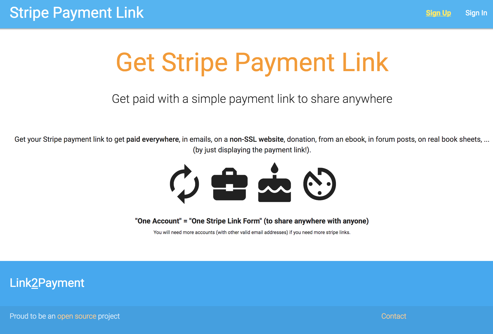

# Link2Payment

Get your Stripe payment link to get paid everywhere, in emails, on a non-SSL website, donation, from an ebook, on a book (by just displaying the payment link, ...).

Psst! It now works also with PayPal! Get easier your PayPal Payment Link than generating a PayPal button through the old and painful PayPal website.

**Link2Payment** is based on the same code (little bit improved though) than another startup idea called "[MyNewDream.eu](https://github.com/pH-7/MyDreamLife.eu)"

The project is based on a homemade lightweight PHP framework (ideal for very small web apps). Feel free to use it if you like it :smiley:

## Requirements

* **Server** PHP 7.1 or newer
* **Database** MySQL/MariaDB 5.0.3 or newer
* **Package Manager** Composer
* **Package Manager** NPM

## The Author

I'm [Pierre-Henry Soria](http://ph7.me). A super passionate, Belgian software engineer :chocolate_bar:

You can contact me at *hi {[AT]} ph7 [{D0T}] me*

## Project URL

[https://link2payment.co](https://link2payment.co) :smiley:

## Setting Up

* Run composer to install the project dependencies.
* Create a database and import `database.sql` file.
* Rename `.env.example` to `.env` and edit SITE_URL and DB details.

## License

Under [General Public License 3](http://www.gnu.org/licenses/gpl.html) or later.
